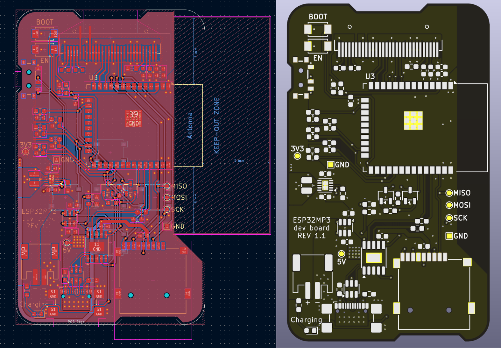

# **ESP32 MP3**

A self-built, portable MP3 player based on ESP32, combining a custom hardware design with an intuitive software interface. It reads music from an SD card, streams audio to any Bluetooth audio device, and is controlled via an OLED display and physical buttons.

[](images/front_back_rev1.1.png)

## **Introduction**

This project evolved from a simple software experiment. The initial version was merely a proof-of-concept for Bluetooth audio streaming from an ESP32. Driven by the desire to create a complete and presentable product, I designed and built a custom dev board, developing an entire graphical and physical user interface from scratch.

The result is a functional and integrated device, demonstrating expertise in both hardware design (PCB design with KiCad) and complex firmware development (modular C++ architecture).

## **✨ Key Features**

#### **Hardware**

*   **Custom Dev Board (Rev 1.1)**: Development board entirely designed with KiCad to house all components compactly and functionally.
*   **0.96" OLED Display**: Monochrome screen (SSD1306 128x64) for a clear, low-power user interface.
*   **Physical Controls**: Interface navigation is managed by 5 physical buttons (Up, Down, Left, Right, Enter).
*   **MicroSD Card Storage**: A MicroSD card slot allows easy loading and playback of your music library.
*   **Power Management**: Power circuit with support for Li-Ion batteries and USB-C charging.

#### **Software**

*   **Bluetooth Audio Streaming (A2DP Source)**: Connects to Bluetooth headphones and speakers for high-quality wireless playback.
*   **Multi-screen User Interface**:
    *   **Bluetooth Device Selection**: Scans for nearby audio devices and manages the connection.
    *   **Track Selection**: Allows browsing the complete playlist of songs on the SD Card.
    *   **Now Playing**: Displays track information (if available), song title, artist, and a progress bar.
    *   **Volume Control**: (WIP, coming soon) Adjusts the playback volume directly from the interface.
*   **Advanced Playlist Management**: Automatically scans the SD card on startup to find all `.mp3` files.
*   **Intuitive User Input**: Supports short press, long press, and auto-repeat of buttons for smooth and fast navigation.
*   **Modular Firmware Architecture**: The code is organized into specialized "Managers" (Display, Input, Bluetooth, Player), making the system scalable, maintainable, and easy to debug.

## **⚙️ Hardware Details**

The development board was designed in KiCad to integrate the ESP32 with all necessary modules. The design is optimized for manual assembly and for use as a portable device.

[](images/PCB_3D.png)

*   **Design Software**: KiCad
*   **Main Processor**: ESP32-WROOM-32E module
*   **Display**: 0.96 inch (128x64) SSD1306 I2C/SPI OLED module
*   **Storage**: Standard MicroSD card reader
*   **Hardware Repository**: KiCad project files (schematics, PCB, and libraries) are available in the [`/Hardware/devboard Rev1.1`](/Hardware/devboard%20Rev1.1/) folder.

## **💻 Software Details**

The firmware is developed using the Arduino framework within PlatformIO, which simplifies dependency management and compilation.

*   **Framework**: Arduino / PlatformIO
*   **Key Libraries**:
    *   **[`U8g2`](https://github.com/olikraus/U8g2)**: Excellent library for managing monochrome displays.
    *   **[`arduino-audio-tools`](https://github.com/pschatzmann/arduino-audio-tools)**: For the audio decoding and processing pipeline.
    *   **[`ESP32-A2DP`](https://github.com/pschatzmann/ESP32-A2DP)**: For implementing the Bluetooth A2DP Source stack.
    *   **[`arduino-libhelix`](https://github.com/pschatzmann/arduino-libhelix)**: Provides the MP3 decoder based on Helix.
*   **Architecture**: The heart of the software is a state machine that manages navigation between different screens (`AppScreen`). The logic is divided into independent manager classes that communicate via an event system (`InputEvent`) and shared states, ensuring high cohesion and low coupling between modules.

## **🚀 Getting Started**

> [!NOTE]  
> If you want to try a simplified version of the project, you can try the alpha version, a proof of concept that only requires a breakout module for the micro SD and an ESP32 board. Follow the `README` in the alpha version for instructions.

#### **1. Hardware Prerequisites**

*   The assembled Dev Board.
*   A MicroSD card formatted as FAT32 and loaded with `.mp3` files. Is required for the files to have a sample rate of 44100 Hz, use the following `ffmpeg` command to convert files if needed:

    ```bash
    ffmpeg -i input.mp3 -ar 44100 output.mp3
    ```
*   A USB-C cable to upload the firmware.

#### **2. Software Setup**

The project is designed to be compiled with PlatformIO in Visual Studio Code.

1.  **Install VS Code and PlatformIO**: Follow the [official PlatformIO guide](https://platformio.org/install/ide?install=vscode).
2.  **Clone the Repository**:
    ```bash
    git clone https://github.com/GiacoBot/ESP32MP3.git
    cd ESP32MP3
    ```
3.  **Initialize Submodules**: The audio libraries are included as Git submodules.
    ```bash
    git submodule update --init --recursive
    ```

#### **3. Compile and Upload**

1.  **Open the Project**: In VS Code, open the project folder. Make sure to open the `Software` subfolder.
> [!IMPORTANT]  
> The PlatformIO project is located within the `Software` folder. When you open this project in VS Code, make sure you open the `Software` directory, not the root of the repository, to ensure PlatformIO can find all the necessary files.

1.  **Change Board settings**: Modify the `src/settings.h` file to match your hardware configuration if necessary (e.g., pin assignments).
2.  **Compile and Upload**: Use the PlatformIO commands (down arrow on the status bar) to build and upload the firmware to the board.

## **📸 Gallery**

Various screenshots of the user interface:

[](images/menus.png)

## **📜 License**

This project is released under the GPL-3.0 License. See the [LICENSE](LICENSE) file for more details.
